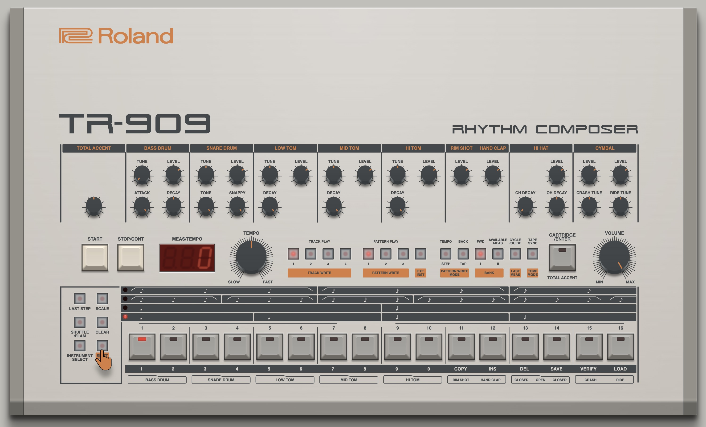

### Disclaimer
_**The use of any trade name or trademark is for identification and educational purposes only and does not imply any association with the trademark holder of their product brand.**_

### TR-909
This is a web version of the [Roland TR-909](https://en.wikipedia.org/wiki/Roland_TR-909) drum-machine with painfully hand-made generated html, svg & css and a proper web-audio-api sound engine. It emulates the exact same cumbersome user experience of the original machine.

### Development State
About 90% of the 909 features are already implemented. The original is quite intricate to operate but I didn't want to break the retro feeling, so I kept close to the original behaviour. Hence this version is even worse to operate since we only have one mouse cursor. It is quite fun with a large multi-touch device, but even when using all keyboard-shortcuts, you can be quick to very cool results.

*To preview the sounds right after booting, click the main-keys in the bottom row. They all play their sounds as the original machine does.*

[Manual](https://github.com/andremichelle/tr-909/wiki/Manual) | [Issues](https://github.com/andremichelle/tr-909/issues)

### Credits
Thanks to [Sascha Kaltenschnee](https://soundcloud.com/cyberpvnk) for lending me his [DinSync RE-909](https://www.kumptronics.com/shop/electronic-instruments/), which is an exact hardware copy of the original [TR-909](https://en.wikipedia.org/wiki/Roland_TR-909).

Logo SVGs (Roland, TR-909 & Rhythm Composer) by [Isaac Cotec](https://subaqueous.gumroad.com/l/hmOwu?recommended_by=search&_ga=2.213635036.938996232.1655202059-1482949479.1654938206&_gl=1*yr8fvz*_ga*MTQ4Mjk0OTQ3OS4xNjU0OTM4MjA2*_ga_6LJN6D94N6*MTY1NTIwMjA3My4zLjEuMTY1NTIwMjA3OC4w)

### Open 
[909.kitchen (CHROME | SAFARI)](https://909.kitchen) _does not work in [Firefox](https://github.com/andremichelle/tr-909/issues/4)_

### Build
Make sure to have sass installed and run

    sass sass/main.sass:bin/main.css --watch

Make sure to have typescript installed and run

    tsc -p ./typescript/tsconfig.json --watch
